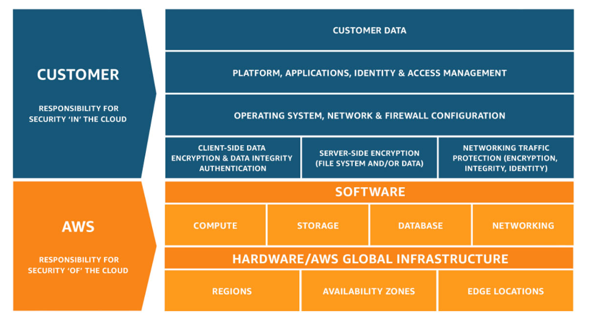
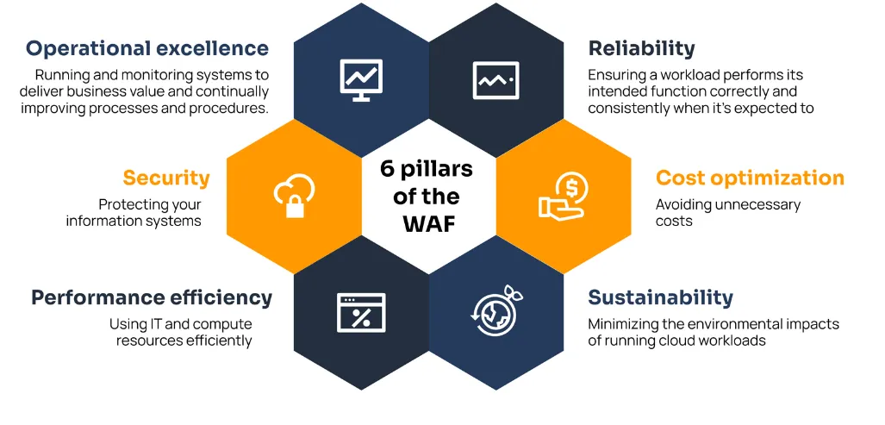

# AWS Certification Essentials

## AWS Global Infrastructure

### Region

Is a physical location in the world consisting of two or more Availability Zones

### Availability Zone

Are one or more data centers, each redundant power networking and low latency connectivity housed in separate facilities to reduce impact of disasters

### Edge Location

Are endpoints for AWS that are used for caching content, typically Cloudfront.

---

## AWS Shared Responsibility Model

## AWS Well Architected Framework

