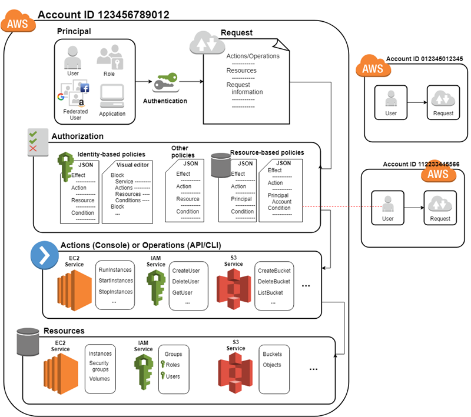
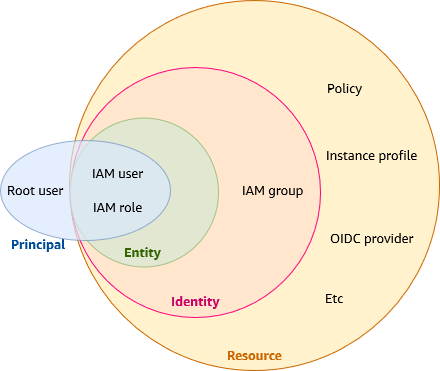

# Identity and Access Management (IAM)

AWS Identity and Access Management (IAM) is a web service that helps you securely control access to AWS resources. With IAM, you can manage permissions that control which AWS resources users can access. You use IAM to control who is authenticated (signed in) and authorized (has permissions) to use resources:

- Is a global service, offering your account a unique authentication database

## How IAM works



## IAM terms



### IAM Resource

The IAM service stores these resources. You can add, edit, and remove them from the Console.

- IAM user
- IAM group
- IAM role
- Permission policy
- Identity-provider object

### IAM Entity

An IAM entity is a type of identity that represents a human user or programmatic workload that can be authenticated and then authorized to perform actions in AWS accounts.
IAM resources that AWS uses for authentication.

- IAM user
- IAM role

Specify the entity as a Principal in a resource-based policy.

### IAM Identity

An IAM identity can be associated with one or more policies, which determine what actions an identity is authorized to perform, on which AWS resources, and under what conditions.
Identities include

- IAM users
- IAM groups
- IAM roles

IAM grants IAM users and the root user long-term credentials and IAM roles temporary credentials.

### IAM root user

When you first create an AWS account, you begin with one sign-in identity that has complete access to all AWS services and resources in the account. This identity is called the AWS account root user

- The root user has full access to everything within the account
- Immediately enable MFA for the root user and set strong password policy
- Avoid using Root at all costs!
- The root user email address must be a unique email. It cannot be reused!

### IAM users

An IAM user is an identity within your AWS account that has specific permissions for a single person or application.

### IAM groups

An IAM user group is an identity that specifies a collection of IAM users. Users can belong to multiple IAM Groups at one time.

### IAM roles

An IAM role is an identity within your AWS account that has specific permissions. It's similar to an IAM user, but isn't associated with a specific person

## Policies and permissions in AWS IAM

Manage access in AWS by creating policies and attaching them to IAM identities (users, groups of users, or roles) or AWS resources. A policy is an object in AWS that, when associated with an identity or resource, defines their permissions. AWS evaluates these policies when an IAM principal (user or role) makes a request

## Policy Types

- Identity-based
- Resource-based
- Permissions Boundaries
- Organization Service Control Policies (SCP)
- Organization Resource Control Policies (RCP)
- Access Control Lists
- Session Policies

## Identity-based Policies

Identity-based policies are JSON permissions policy documents that control what actions an identity (users, groups of users, and roles) can perform, on which resources, and under what conditions. Identity-based policies can be further categorized:

- Managed policies: Standalone identity-based policies that you can attach to multiple users, groups, and roles in your AWS account. There are two types of managed policies:
  - AWS managed policies Managed policies that are created and managed by AWS.
  - Customer managed policies: Managed policies that you create and manage in your AWS account. Customer managed policies provide more precise control over your policies than AWS managed policies.
- Inline policies: Policies that you add directly to a single user, group, or role for a specific use case. Inline policies maintain a strict one-to-one relationship between a policy and an identity, not reusable. They are deleted when you delete the identity.

## Resource-based Policies

JSON policy documents that get attached to AWS resources. Grant permissions to a specified IAM principal for the resource. All resource-based policies **are inline policies**. There are no managed resource-based policies. Add the external account/IAM entity as a principal in your resource-based policy, but that alone isn't enough — you also need an identity-based policy on the principal's side. Exception: same-account access only needs the resource-based policy.

## Permissions Boundaries

A permissions boundary sets a ceiling on what an IAM entity can do — even if the identity policy grants more, the boundary is the limit. When a resource-based policy is involved, whether the boundary needs to explicitly allow access depends on how the principal is referenced:

- Principal is a role session or user: the boundary can stay silent on it, access still works
- Principal is a role ARN: the boundary must actively permit it or it's blocked

## AWS Organizations service control policies (SCPs)

If you enable all features in an organization, then you can apply service control policies (SCPs) to any or all of your accounts. SCPs are JSON policies that specify the maximum permissions for IAM users and IAM roles within accounts of an organization or organizational unit (OU). The SCP limits permissions for principals in member accounts, including each AWS account root user. An explicit deny in any of these policies overrides an allow in other policies.

## AWS Organizations resource control policies (RCPs)

If you enable all features in an organization, then you can use resource control policies (RCPs) to centrally apply access controls on resources across multiple AWS accounts. RCPs are JSON policies that you can use to set the maximum available permissions for resources in your accounts without updating the IAM policies attached to each resource that you own. The RCP limits permissions for resources in member accounts and can impact the effective permissions for identities, including the AWS account root user, regardless of whether they belong to your organization. An explicit deny in any applicable RCP overrides an allow in other policies that might be attached to individual identities or resources.

## Access control lists (ACLs)

Access control lists (ACLs) are service policies that allow you to control which principals in another account can access a resource. ACLs cannot be used to control access for a principal within the same account. ACLs are similar to resource-based policies, although they are the only policy type that does not use the JSON policy document format. Amazon S3, AWS WAF, and Amazon VPC are examples of services that support ACLs. To learn more about ACLs, see Access Control List (ACL) overview in the Amazon Simple Storage Service Developer Guide.

## Session policies

Session policies are advanced policies that you pass as a parameter when you programmatically create a temporary session for a role or an AWS STS federated user principal. The permissions for a session are the intersection of the identity-based policies for the IAM entity (user or role) used to create the session and the session policies. Permissions can also come from a resource-based policy. An explicit deny in any of these policies overrides the allow.

## Overview of JSON policies

Most policies are stored in AWS as JSON documents. Identity-based policies and policies used to set permissions boundaries are JSON policy documents that you attach to a user or role. Resource-based policies are JSON policy documents that you attach to a resource. SCPs and RCPs are JSON policy documents with restricted syntax that you attach to the AWS Organizations' organization root, organizational unit (OU), or an account. ACLs are also attached to a resource, but you must use a different syntax. Session policies are JSON policies that you provide when you assume a role or federated user session.

Here's a complete example:

```json
{
  "Version": "2012-10-17",
  "Id": "S3-Account-Permissions",
  "Statement": [
    {
      "Sid": "AllowS3ListBucket",
      "Effect": "Allow",
      "Principal": {
        "AWS": "arn:aws:iam::123456789012:user/diego"
      },
      "Action": ["s3:ListBucket", "s3:GetObject"],
      "Resource": ["arn:aws:s3:::my-bucket", "arn:aws:s3:::my-bucket/*"],
      "Condition": {
        "IpAddress": {
          "aws:SourceIp": "192.0.2.0/24"
        }
      }
    },
    {
      "Sid": "DenyDeleteBucket",
      "Effect": "Deny",
      "Action": "s3:DeleteBucket",
      "Resource": "*"
    }
  ]
}
```

**Policy Elements:**

- **Version**: Policy language version (typically "2012-10-17")
- **Id**: Identifier for policy (optional, but recommended for clarity)
- **Statement**: One or more individual statements (required)
- **Sid**: Statement ID (optional, but recommended for clarity)
- **Effect**: Either "Allow" or "Deny" access
- **Principal**: Account/user/role identity to which this policy applies (used in resource-based policies; optional for identity-based policies)
- **Action**: Specific AWS API actions (can use wildcards like "s3:\*")
- **Resource**: ARN (Amazon Resource Name) where the action applies
- **Condition**: Optional conditions that must be true for the policy to apply

## Policies Order in Case of Overlapping Permissions

1. **Explicit Deny**: Any explicit deny overrides all allows.
2. **Explicit Allow**: If any policy allows an action, it's allowed
3. **Implicit Deny**: Default - everything is denied unless explicitly allowed

IAM Users do not have any permissions when they are first created.

## Grant least privilege

When you create IAM policies, follow the standard security advice of granting least privilege, or granting only the permissions required to perform a task. Determine what users and roles need to do and then craft policies that allow them to perform only those tasks.

## Access Keys

- Long-term credentials for IAM users and the Root user account
- Used to sign programmatic requests via CLI or AWS SDK
- Composed of Access Key ID and Secret Access Key
- Secret Access Key is only viewable at time of creation

## IAM Credential Reports

Can generate credential reports every 4 hours regarding IAM users, access keys, and MFA status.

## IAM Roles

An IAM role is an IAM identity that you can create in your account that has specific permissions. An IAM role is similar to an IAM user, in that it is an AWS identity with permission policies that determine what the identity can and cannot do in AWS. However, instead of being uniquely associated with one person, a role is intended to be assumable by anyone who needs it. Also, a role does not have standard long-term credentials such as a password or access keys associated with it. Instead, when you assume a role, it provides you with temporary security credentials for your role session. No long-term credentials used, credentials are temporary and rolling.

## Types of IAM Roles

- **Service-linked Roles**: Allow AWS services to access AWS resources securely
- **Instance Profiles**: Attached to EC2 instances to allow use of the IAM Role
- **Federated Identities**: Allow external identities to assume roles

## Use Cases

- Grant access to Lambda functions to allow them to access AWS resources like DynamoDB.
- Grant access to EC2 instances to allow them to interact with services like S3.
- Set up a role to allow cross-account access from another AWS account for third-party vendors.

## AWS Security Token Service (STS)

AWS provides AWS Security Token Service (AWS STS) as a web service that enables you to request temporary, limited-privilege credentials for users. IAM Roles generate their credentials with this service, enabling you to request short-term, temporary credentials for users. Commonly used with SAML federation and OIDC federation.

## Delegation

The granting of permissions to someone to allow access to resources that you control. Delegation involves setting up a trust between two accounts. The first is the account that owns the resource (the trusting account). The second is the account that contains the users that need to access the resource (the trusted account). The trusted and trusting accounts can be any of the following:

- The same account.
- Separate accounts that are both under your organization's control.
- Two accounts owned by different organizations.

To delegate permission to access a resource, you create an **IAM role** in the trusting account that has two policies attached. The permissions policy grants the user of the role the needed permissions to carry out the intended tasks on the resource. The trust policy specifies which trusted account members are allowed to assume the role

## IAM Role Trust Policy

A JSON policy document in which you define the principals that you trust to **assume the role**. A role trust policy is a required resource-based policy that is attached to a role in IAM. The principals that you can specify in the trust policy include users, roles, accounts, and services.

## Role for Cross-Account Access

A role that grants access to resources in one account to a trusted principal in a different account. Roles are the primary way to grant cross-account access. However, some AWS services allow you to attach a policy directly to a resource (instead of using a role as a proxy). These are called resource-based policies, and you can use them to grant principals in another AWS account access to the resource.

```json
{
  "Version": "2012-10-17",
  "Statement": [
    {
      "Sid": "AllowIAMUser",
      "Effect": "Allow",
      "Principal": {
        "AWS": "arn:aws:iam::111122223333:user/MyUser"
      },
      "Action": "sts:AssumeRole"
    },

    {
      "Sid": "AllowCrossAccountRole",
      "Effect": "Allow",
      "Principal": {
        "AWS": "arn:aws:iam::444455556666:role/MyRole"
      },
      "Action": "sts:AssumeRole",
      "Condition": {
        "StringEquals": {
          "sts:ExternalId": "my-external-id"
        }
      }
    },

    {
      "Sid": "AllowLambdaService",
      "Effect": "Allow",
      "Principal": {
        "Service": "lambda.amazonaws.com"
      },
      "Action": "sts:AssumeRole"
    },

    {
      "Sid": "AllowSAMLFederation",
      "Effect": "Allow",
      "Principal": {
        "Federated": "arn:aws:iam::111122223333:saml-provider/MyProvider"
      },
      "Action": "sts:AssumeRoleWithSAML",
      "Condition": {
        "StringEquals": {
          "SAML:aud": "https://signin.aws.amazon.com/saml"
        }
      }
    },

    {
      "Sid": "AllowOIDCFederation",
      "Effect": "Allow",
      "Principal": {
        "Federated": "arn:aws:iam::111122223333:oidc-provider/token.actions.githubusercontent.com"
      },
      "Action": "sts:AssumeRoleWithWebIdentity",
      "Condition": {
        "StringEquals": {
          "token.actions.githubusercontent.com:aud": "sts.amazonaws.com",
          "token.actions.githubusercontent.com:sub": "repo:myorg/myrepo:ref:refs/heads/main"
        }
      }
    }
  ]
}
```

## EC2 Instance Profiles

Attached to IAM roles and allow EC2 instances to obtain the role credentials.

## AWS CloudShell

Browser-based shell for easier interactions with your AWS resources.AWS CloudShell offers a preinstalled, preauthenticated session for using the AWS CLI.

- Pre-authenticated using your console credentials.
- Lots of pre-installed software and tools to get started quickly.
