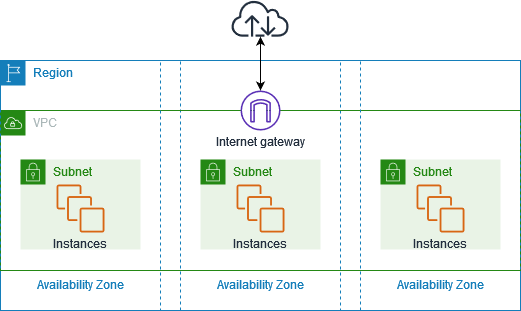
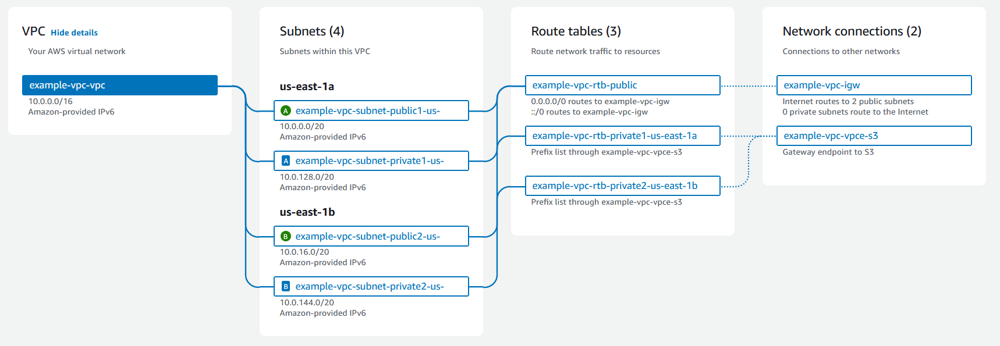

# Amazon Virtual Private Cloud (VPC)

Isolated part of AWS Cloud where you can define your own network, with complete control of virtual networks, including IP address ranges, subnets, route tables, and network gateways.

## VPC how it works and resources



## Types of VPCs

- **Default VPC**: Automatically created by AWS when an AWS account is created with CIDR 172.31.0.0/16
- **Custom VPC**: Created by you with a custom CIDR block range

## VPC Components

- **CIDR Block**: IP range for the VPC.
- **Subnets**: Subdivisions of the VPC, is a range of IP adderesses in your VPC. A subnet must reside in a single Availability Zone. After you add subnets, you can deploy AWS resources in your VPC.
- **Route Tables**: Define routing rules for traffic.
- **Security Groups**: Virtual firewall for compute resources.
- **Network Access Control Lists (NACLs)**: Stateless firewall rules.
- **Network Gateways**: A gateway connects your VPC to another network. For example, use an internet gateway to connect your VPC to the internet. Use a VPC endpoint to connect to AWS services privately, without the use of an internet gateway or NAT device.



## Creating VPCs

When creating a VPC, you need to:

- Select an IP CIDR block to use for the networking resources.
- Private IPv4 CIDR blocks are required and range from /16 to /28.
- IPv6 CIDR blocks are optional and range from /44 to /60.
- CIDRs must be from the RFC 1918 range: 10.0.0.0, 172.16.0.0, 192.168.0.0.
- Consider IP planning when creating a VPC.

Amazon VPCs are regional resources with a limit of 5 VPCs per Region, per account.

## IP addressing for your VPCs and subnets

IP addresses enable resources in your VPC to communicate with each other, and with resources over the internet.
Classless Inter-Domain Routing (CIDR) notation is a way to represent an IP address and its network mask.

## IPv4 CIDR Notation

IPv4 range is made up of 32 total bits:

```yaml
<8bits>.<8bits>.<8bits>.<8bits>/<submask>
```

Common subnet masks:

- `/8` = 255.0.0.0 = 11111111.00000000.00000000.00000000
- `/16` = 255.255.0.0 = 11111111.11111111.00000000.00000000
- `/20` = 255.255.240.0 = 11111111.11111111.11110000.00000000
- `/24` = 255.255.255.0 = 11111111.11111111.11111111.00000000

**Example**: 10.0.0.0/16 → 32 total bits – 16 used bits

This means there are 16 remaining bits (last two octets) for usable IPs: 2^16 = 65,536 IPs.

10.0.0.0/20 → 32 total bits – 20 used bits

This means there are 12 remaining bits for usable IPs: 2^12 = 4096 IPs.

## Private IP Ranges

VPCs use private address space, meaning they are NOT publicly resolvable, are not reachable over the internet:

- 10.0.0.0/8
- 172.16.0.0/12
- 192.168.0.0/16

## VPC Subnet

A subnet is a range of IP addresses in your VPC for hosting resources
Subnet are bound to a single availability Zone

AWS reserves 5 IP addresses per subnet.

Example:

- VPC CIDR: 10.0.0.0/16
- Subnet CIDR: 10.0.0.0/24
- AWS reserves 5 IP addresses per subnet:
  - 10.0.0.0 Network adress
  - 10.0.0.1 VPC Router
  - 10.0.0.2 VPC DNS Server
  - 10.0.0.3 Future Use
  - 10.0.0.255 Broadcast Address

### Subnets support IP address modes

IPv4-only: standard; resources communicate over IPv4.
Dual-stack: both IPv4 and IPv6; VPC must also have both.
IPv6-only: resources get IPv4 link-local addresses (169.254.x.x) for internal VPC services only, but communicate externally over IPv6.

### Subnet types

Public: has a route to an Internet Gateway; resources can reach the internet.
Private: no Internet Gateway route; needs a NAT device for outbound internet access.
VPN-only: routes only to a Site-to-Site VPN via a Virtual Private Gateway.
Isolated: no external routes at all; fully internal.

## Route Tables

Every subnet must be associated with a route table. New subnets automatically get the VPC's main route table, but you can reassign it. A **route table** serves as the traffic controller for your virtual private cloud (VPC)

### Route Tables Types

### Main route table

The route table that automatically comes with your VPC. It controls the routing for all subnets that are not explicitly associated with any other route table.

### Custom route table

A route table that you create for your VPC.

### Custom route table concepts and terms

### Destination

The range of IP addresses where you want traffic to go (destination CIDR). For example, an external corporate network with the CIDR 172.16.0.0/12.

### Target

The gateway, network interface, or connection through which to send the destination traffic; for example, an internet gateway.

### Local route

A default route for communication within the VPC. If the VPC has both IPv4 and IPV6 addresses, there is a local route for IPv4 and a local route for IPv6.

### Association

The association between a route table and a subnet, internet gateway, or virtual private gateway.

## Network Access Control List (ACL)

A **network access control list (ACL)** allows or denies specific inbound or outbound traffic at the subnet level.
